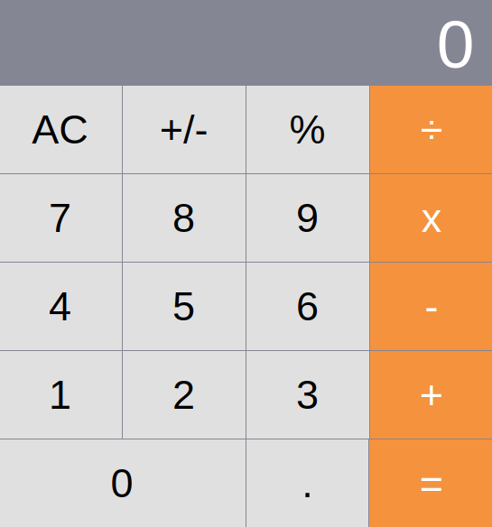

<h1 style="color: rgb(20, 41, 225)">CALCULATRICE IOS</h1>

## A project created with [Vite](https://vitejs.dev/)
(Vite requires **Node.js version 14.18 at least**)

All the features of a basic calculator !

The goal of this project is to transform React code with classes into React code with functions and hooks

Original project with classes : https://github.com/ahfarmer/calculator
- - -
# TO SEE THIS PROJECT IN ACTION LOCALLY :

- git clone git@github.com:Tadkozh/CalculatorHook.git
- npm install
- npm run dev
- enjoy !

